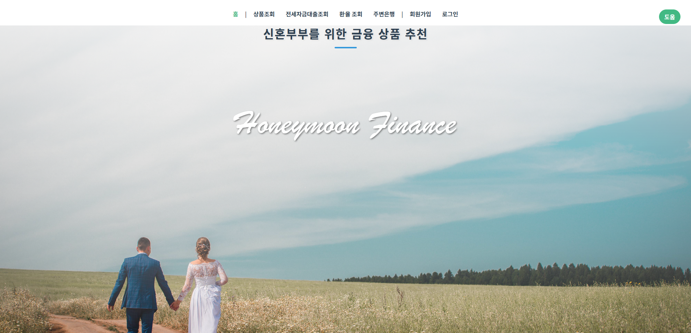

### 📓 프로젝트 개요
- 설명 : 신혼부부를 위한 금융 상품 추천
- 기간 : 2024.11.18(월) ~ 2024.11.27(금)


### 🦝 서비스 특징

- 금융 설문 조사를 기반으로 금융 상품 추천
- 유저 경험(UX)을 우선하여 로그인없이 대부분의 서비스 제공
- 챗봇을 통해 상품 추천 탐색 가능
 

### ⚙ 주요 기능

- 실시간 환율 계산기
- 지도에서 은행 지점 정보 제공
- 설문 결과에 따른 자산 추천
- 챗봇을 통해 실시간 질의응답 가능
- 적금 가입 기간 별 조회


### 🦾 팀 소개 
- **김민표** : 팀장, 아이디어 기획, Django, Vue.js 활용한 풀스택 개발, ERD 설계, dj-rest-auth를 통해 로그인, 로그아웃, 회원가입, 마이페이지 등 유저 관리 기능, open ai API를 이용하여 챗봇 서비스 구현, CSS를 통한 페이지 꾸미기, 금융감독원 API를 통해 전세자금대출 상품 조회, 메인페이지 제작

- **변희수** : 팀원, 아이디어 기획, Django, Vue.js 활용한 풀스택 개발, UI 디자인, 카카오맵 API를 통한 주변 은행 검색, 환율 API를 활용하여 실시간 환율 계산, 금융감독원 API를 통해 예적금 상품 조회, 최종 발표 PPT 제작, vuetify를 활용하여 홈페이지 제작


## 🛒 기술 스택

### Frontend
&nbsp;
&nbsp;
&nbsp;
&nbsp;


### Backend
&nbsp;
&nbsp;
&nbsp;

### DevOps
&nbsp;


### Tools
&nbsp;
&nbsp;
&nbsp;
&nbsp;


<br />

## 개발 환경

🔧 **Backend**
- django 4.2.16

🔧 **Frontend**
- vue.js 3.3.4

<br/>

## 💿 프로젝트 폴더 구조

- Frontend - Vue.js

```

```
- Backend - Django
```
backend
├─accounts
├─api
├─articles
└─finlife
```

<br/>

## 🖨 ERD


<details>
<summary><b>명명법</b></summary> 

- 프론트엔드
    - 변수명, 메서드명
        - `camelCase`
    - HTML 템플릿
        - `kebab-case`
    - CSS 클래스
        - 고유한 클래스명 부여하여 부모 컴포넌트 내의 속성 상속을 방지
    - 의미없는 변수명 사용 지양

- 백엔드
    - 클래스명
        - `PascalCase`
    - 함수명
        - `snake_case`
    - 의미없는 변수명 사용 지양
</details>

<br/>

## 🔈 기능 상세 설명
### 메인페이지

- 주요 기능 링크를 내비게이션 바 및 이미지 위 버튼으로 제공
   
### 예적금 및 대출 상품 추천 페이지


- 사용자의 설문 입력 값에 따라 서로 다른 예적금 상품 추천
- 추천 결과를 브라우저 단에 저장하여 페이지 이탈 후에도 다시 조회가 가능
- 로그인하지 않아도 참여가 가능하게 만들어 서비스 유입량 향상


### 예적금 상품 조회


- 시중 은행의 예금 상품과 그에 따른 옵션 정보 제공
- 예금 상품에 대한 자세한 설명 제공하여 사용자가 한 페이지 내에서 비교 가능하게 함
- 관심있는 상품에 대한 상세 조회 시 기간에 따른 옵션, 저축 금리 및 최대 금리 정보 제공
- 비교를 원하는 상품 옵션을 찜하면 모아볼 수 있는 페이지 제공
- 관심 상품들의 금리를 차트로 도형화하여 직관적인 정보 전달
- 관심 상품 목록은 브라우저단에 저장하여 페이지 이탈 후에도 유지됨
- 로그인하지 않은 사용자도 이용 가능하여 사용자 편의성 증대

### 커뮤니티 게시판

- 카피바라 회원들 간의 금융 지식 공유가 가능한 공간
- 댓글 기능을 통해 의견을 나눌 수 있음
- 로그인한 사용자만 조회와 게시가 가능하여 exclusive한 경험 제공
  
### 환율계산기


- 출발 통화와 도착 통화를 선택하면 실시간 환율 정보 제공
- 사용자가 환전하고자하는 금액 입력 시 예상 환전 금액 제공

### 주변 은행 지도


- 지역과 은행 선택시 해당 지역 및 인근 지역의 은행 지점 정보 제공
- 찾고자 하는 은행만 선택시 전국의 은행 지점 표출

### 회원 페이지


- 회원 가입을 통해 닉네임을 설정하고 커뮤니티 게시판 사용이 가능
- 회원정보 조회 및 수정, 비밀번호 변경, 로그아웃 기능 포함


## 📃 문서
[💻 Notion](https://bustling-trade-bc8.notion.site/project-edee400fdbb84c5ebda96cba3ada5c77?pvs=4)


## API 입력 위치
```
Backend
카카오맵 : frontend\src\components\MapComponent.vue
변수명 const KAKAO_KEY에 할당
API키를 .env에서 찾아서 입력
api 레퍼런스 주소 : https://apis.map.kakao.com/web/guide/ JavaScript  키

Frontend
금융감독원 : backend\api\settings.py
변수명 API_KEY에 할당
API키를 .env에서 찾아서 입력
api 레퍼런스 주소
- 예금 : https://finlife.fss.or.kr/finlife/api/fdrmDpstApi/list.do?menuNo=700052
- 적금 : https://finlife.fss.or.kr/finlife/api/fdrmDpstApi/list.do?menuNo=700052
```
